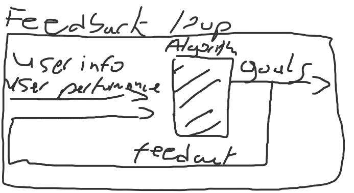

# Personal Trainer Big Picture

## How it works

The personal trainer will use a calendar system. On day 0, user will enter personal info and the personal trainer will set the users first goals based on that info. It will set up goals for the user based on the entered personal info. These goals will be constant for the first few days. Goals can be things such as calories burned, etc.

 

After around 3 days, if the trainer sees that the user have achieved their goals consecutively, the trainer will increase the daily goal. If the user hasn't been achieving their goals consecutively, the trainer will decrease the daily goal. The user can decline or accept this increase/decrease. The increase/decrease will be based on how much more than they goal they achieved (Ex. If the trainer told u to run 2 miles and u ran 26 miles, the increase will be much more bigger than running 5 miles). 

 

The user will also be able to set a schedule. For example, if the user doesn't want to exercise everyday, he can select the days he wants to exercise  and he can also increase or decrease the goals on demand. However, the personal trainer will still make recommendations, but will not stop the user from making demands. (Ex. If the user wants to decrease his goal, the personal trainer will say "Are you sure you want to do this? You have been consistently achieving your goals" but will not stop the user from doing so).

 

The personal trainer will also make tips and suggestions. Every week, it will ask you to enter your personal data again. It will calculate things such as the weight loss or calorie loss and make recommendations on diet, how much exercise, etc. It will also make daily recommendations and tips (Ex. To maintain healthy, you need to do lots of exercise, maintain a healthy and balanced diet, and get lots of sleep!)
